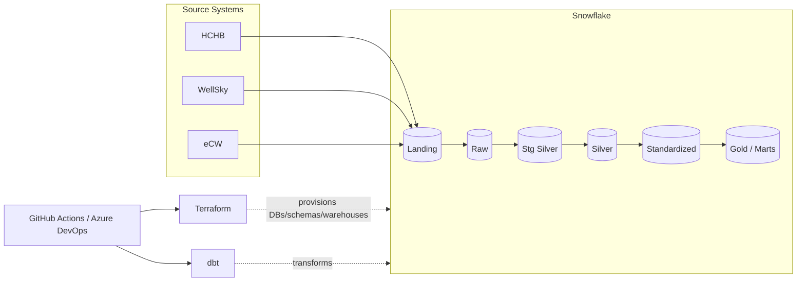

# HCHB Platform — Snowflake + dbt + Terraform CI/CD

Production-ready data platform: Terraform provisions Snowflake objects, dbt
transforms raw data through a medallion architecture (Landing → Raw → Fusion
→ Consumption), and two parallel CI/CD pipelines (GitHub Actions and Azure
DevOps) automate lint, test, build, and deploy across **dev**, **staging**,
and **prod**.

## ⚠️ Security notice (read first)

While preparing this pipeline, the uploaded `dbt/profiles.yml` contained a
**hardcoded Snowflake key passphrase** (`MyStrongPassword690!`) and the
Terraform folder contained a stray `cicd-user-private-key.pem` file. Both
have been removed from this package:

- `profiles.yml` now pulls every value from environment variables — nothing
  sensitive is committed.
- The empty `.pem` file was deleted; `.gitignore` now blocks `*.pem`, `*.p8`,
  `*.key`, and `.env` from ever being committed again.

**Action for you:** if that passphrase or any private key in the original
project was ever pushed to a git remote (even a private one), treat it as
compromised — rotate the Snowflake key pair and generate a new passphrase,
then update your CI/CD secrets with the new values.

## Architecture



| Layer | Tool | Purpose |
|---|---|---|
| Infrastructure | **Terraform** | Creates Snowflake databases, schemas, warehouses, roles per environment |
| Transformation | **dbt** | Raw → Fusion → Consumption models, tests, and documentation |
| Orchestration | **GitHub Actions** *or* **Azure DevOps** | Lint, validate, build, test, deploy — pick either or run both |

## Repository layout

```
.
├── .github/workflows/
│   ├── ci.yml            # PR checks: terraform fmt/validate, sqlfluff, dbt compile (dev)
│   └── cd.yml             # Deploy: terraform apply + dbt build/test/docs per environment
├── azure-pipelines.yml    # Equivalent pipeline for Azure DevOps
├── azure-pipelines/templates/
│   ├── terraform-steps.yml
│   └── dbt-steps.yml
├── dbt/
│   ├── dbt_project.yml
│   ├── profiles.yml       # env-var driven, safe to commit
│   ├── requirements.txt
│   └── models/…
├── terraform/
│   ├── environments/
│   │   ├── dev.tfvars  staging.tfvars  prod.tfvars
│   │   └── backend-dev.conf  backend-staging.conf  backend-prod.conf
│   └── …
├── .sqlfluff
├── .env.example
└── .gitignore
```

## Environment strategy

Three environments, each with its own Snowflake databases, its own Terraform
state file, and its own set of pipeline secrets:

| Environment | Databases (example) | Trigger (GitHub Actions) | Trigger (Azure DevOps) |
|---|---|---|---|
| **dev**     | `DEV_HC_RAW`, `DEV_HC_FUSION`, … | push to `develop` | push to `develop` |
| **staging** | `STAGING_HC_RAW`, `STAGING_HC_FUSION`, … | push to `main` | push to `main` |
| **prod**    | `PROD_HC_RAW`, `PROD_HC_FUSION`, … | manual `workflow_dispatch`, requires `confirm_prod=DEPLOY` + environment reviewers | manual run, requires `prod` environment approval |

Database names are namespaced by environment so dev/staging/prod never
collide, even though they share one Terraform codebase and one dbt project.

## Required secrets / variables

Set these once per environment (dev / staging / prod). Names are identical
in both platforms so you only have to decide the values once.

**GitHub:** Settings → Environments → `dev` / `staging` / `prod` → Secrets.
**Azure DevOps:** Pipelines → Library → variable groups
`hchb-snowflake-common` and `hchb-azure-backend` (mark secrets as secret ✅,
link to Azure Key Vault if you have one).

| Name | Used by | Description |
|---|---|---|
| `SNOWFLAKE_ORG` | Terraform | Snowflake organization name |
| `SNOWFLAKE_ACCOUNT` | Terraform, dbt | Account locator (e.g. `ex52281.east-us.azure`) |
| `SNOWFLAKE_USER` | Terraform, dbt | Service account username |
| `SNOWFLAKE_ROLE` | Terraform, dbt | Role used for deploys |
| `SNOWFLAKE_WAREHOUSE` | Terraform, dbt | Warehouse name |
| `SNOWFLAKE_PRIVATE_KEY` | Terraform, dbt | Full contents of the RSA private key (PEM) |
| `SNOWFLAKE_PRIVATE_KEY_PASSPHRASE` | Terraform, dbt | Passphrase for the key, if set |
| `ARM_CLIENT_ID` / `ARM_CLIENT_SECRET` / `ARM_SUBSCRIPTION_ID` / `ARM_TENANT_ID` | Terraform | Azure service principal for the `azurerm` state backend |

None of these ever appear in a committed file — they're injected at run
time only.

## Running locally

```bash
cp .env.example .env      # fill in real values, never commit this file
export $(grep -v '^#' .env | xargs)

cd dbt
pip install -r requirements.txt
dbt deps
dbt debug        # confirm the Snowflake connection works
dbt build        # run + test everything
dbt docs generate && dbt docs serve
```

## Running Terraform locally

```bash
cd terraform
terraform init -backend-config="environments/backend-dev.conf"
terraform plan  -var-file="environments/dev.tfvars"
terraform apply -var-file="environments/dev.tfvars"
```

## CI/CD pipeline stages

Both pipelines follow the same shape:

1. **Lint** — `terraform fmt -check`, `terraform validate`, `sqlfluff lint` (never touches Snowflake).
2. **Validate** — `dbt debug` + `dbt compile` against the **dev** warehouse, using a low-privilege CI role. Runs on every pull request.
3. **Deploy** *(branch pushes / manual runs only, skipped on PRs)*:
   - `terraform plan` → `terraform apply` for the target environment.
   - `dbt seed` → `dbt run` (RAW → STG_SILVER → SILVER → STANDARDIZED → GOLD) → `dbt test` → `dbt docs generate`, with docs published as a pipeline artifact.

Production deploys require an explicit human approval gate:
- GitHub Actions: configure **required reviewers** on the `prod` Environment (Settings → Environments), and the `confirm_prod=DEPLOY` input.
- Azure DevOps: configure **approvals** on the `prod` Environment (Pipelines → Environments → prod → Approvals and checks).

## Code quality

- **SQLFluff** (`.sqlfluff`, Snowflake dialect + dbt templater) lints every model.
- **terraform fmt / validate** enforces consistent formatting and catches config errors before any state is touched.
- **dbt test** runs schema and data tests defined in each layer's `*.yml` files.

## Notes on the medallion layers

- `raw` incremental-merges landing data 1:1 per source system (HCHB, ECW, WellSky).
- `fusion.stg_silver` / `fusion.silver` cleanse and conform records per source.
- `fusion.standardized` unifies sources into one canonical shape.
- `consumption.gold` / `marts` / `ai_ml` are the business-facing, reporting-ready layer.

Database routing for every layer is controlled by `DBT_LANDING_DB`,
`DBT_RAW_DB`, `DBT_FUSION_DB`, and `DBT_CONSUMPTION_DB` — set once per
environment in the pipeline, no code changes needed to add a new environment.
